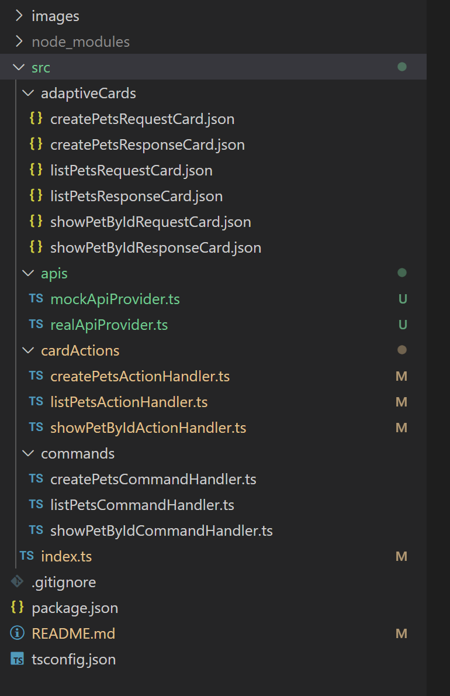

# Converted Teams App Code structure
The code structure of converted project is as below:

In the root folder, there are `package.json`, `README.md` and `tsconfig.json` files.

In the src folder, there are 4 sub folders:
* adaptiveCards folder
    - This folder contains adaptive card generated by Convert Tool based on APIs. Each API will generate two adaptive cards, one is `*RequestCard.json`, and another is `*ResponseCard.json`. Request card is for user to input parameters and click button to send request, and response card is used to render api response data.

* apis folder
    - This folder contains ts file which mock api calls, user need to manually update these files to call real backend service

* cardActions folder
    - This folder contains card action handlers, when user click action button in the request adaptive card, it would use these handlers to get response and render response adaptive card.

* commands folder
    - This folder contains bot command handlers, when user send messages, it will match the api, and send back request adaptive card.



# Discuss
- For adaptive cards: if response schema use `ref` property, we can use component name as the adaptive card name, and can reuse it for different api. However, some response body may not contain `ref` property.

- For apis, we can refer the design of swagger client code generator, use one file as APIs
```ts
export class PetsApi {
    public createPets(options?: any) {}
    public listPets(limit?: number, options?: any) {}
    public showPetById(petId: string, options?: any) {},
}
```

- Tim's questions: why not call real backend service: Because our main target is help user to generate a working demo project, user can update it for real use. Call real code will introduce complexity (such as auth), and most backend service may contain their own sdk, user may want to use the sdk to call real code. And from our previous experience of our connector api inside teamsfx sdk(which generate code to help user to call their apis), and the usage is very low.